<div align="center">

[English](README.md) · **Français**


# Surplomb

### La France au rayon X. Tout ce que vous n'auriez jamais pensé à chercher.

*Aucun angle mort.*


<sub>Imagerie : Google, via Cesium ion.</sub>

</div>

## Ce que c'est

**59 couches de données publiques sur un globe 3D photoréaliste — dont 44 écrites ici.** Le prix auquel l'appartement d'en face s'est vendu et la parcelle exacte qui allait avec. Les permis de construire accordés dans la rue et ceux dont le chantier est déjà ouvert. Le DPE du bâtiment, l'école de secteur, le médecin le plus proche, la délinquance enregistrée, le bruit des avions au-dessus, les îlots de fraîcheur, ce que produit chaque centrale à cette minute, et où sont les bus.

**56 des 59 ne demandent rien** : pas de clé, pas de compte, pas d'inscription. Ouvrez la page, la France est là.

Presque tout vient de registres que l'État publie déjà et que personne n'avait mis sur la même carte : cadastre, DVF, Sitadel, DPE, PLU, Géorisques, BPE, FINESS, Annuaire santé, ANFR, IRVE, GTFS-RT, Vigicrues, Hub'Eau, Météo-France, ODRÉ, RTE, IGN BD TOPO. Et chaque couche dit ce qu'elle refuse de dessiner : Sitadel affiche son taux de jointure sur chaque fiche (91,3 % à Paris, 7,6 % à Toulouse), et un chiffre qu'on ne peut pas placer honnêtement est compté et dit, jamais posé quelque part de faux.

L'open data français est classé premier par l'[OCDE (2025)](https://www.data.gouv.fr/posts/la-france-a-la-premiere-place-du-classement-de-locde-en-matiere-dopen-data) et par le [rapport Open Data Maturity de l'UE](https://www.data.gouv.fr/posts/la-france-classee-premiere-europeenne-en-matiere-dopen-data-pour-la-5e-annee-consecutive) cinq années de suite : c'est ce qui permet à ce fork de porter 44 couches que l'amont n'a pas.

La version hébergée est [surplomb.app](https://surplomb.app).

## Vues du globe

Quatre films tournés dans l'application, chacun sur des couches ajoutées par ce fork ; les plus longs sont découpés en chapitres qui se suivent. Les mouvements de caméra, les cartouches et les effets d'apparition ont été mis en scène pour le tournage. Les formes, les couleurs et les chiffres viennent des données de chaque couche, sauf quand la ligne sous un chapitre dit le contraire. Chaque chapitre porte une seule idée, sous un titre incrusté pour cette page ; quand la fiche ou l'étiquette de l'application la porte, le chapitre se resserre sur elle, presque en taille réelle, pour qu'on puisse la lire.

### Roissy : le bruit des avions

Paris-Charles-de-Gaulle en 3D sous ses vols en direct, le décollage d'un vol en direct, puis le plan d'exposition au bruit de l'aéroport et la fiche de sa zone A.

<div align="center">

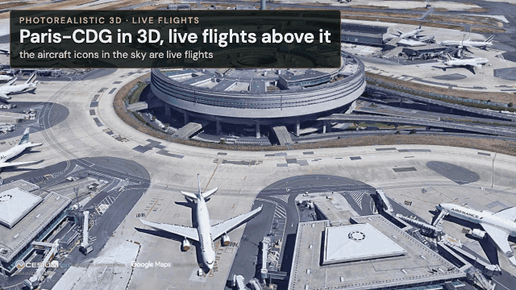

<sub>Secondes 1,8–8,6 du film : le terminal 1 pendant 0,8 s, puis le vol vers la piste joué ×3 et sa fin ×2, et le seuil tenu 1 s. Vols en direct : OpenSky Network, adsb.lol. Imagerie : Google, via Cesium ion.</sub>


<sub>Secondes 8,7–18,5 du film : la course est jouée ×2 et le recul ×3, et l'étiquette est tenue 2 s sur une image. Mis en scène pour le film : la course au décollage dans la vue cockpit, la vitesse et l'altitude affichées par son viseur tête haute ; le cadre suit l'horizon quand l'avion se cabre. Le vol, son indicatif, son altitude, sa vitesse et sa route sont en direct : OpenSky Network, adsb.lol. Imagerie : Google, via Cesium ion.</sub>

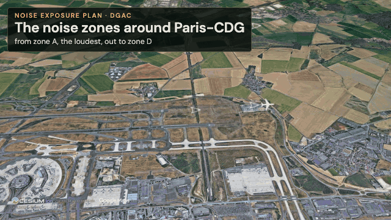

<sub>Secondes 19,3–24,5 du film : la montée est jouée ×3 et la dernière image tenue 1,5 s. Données : plans d'exposition au bruit de la DGAC, via la Géoplateforme de l'IGN. Imagerie : Google, via Cesium ion.</sub>

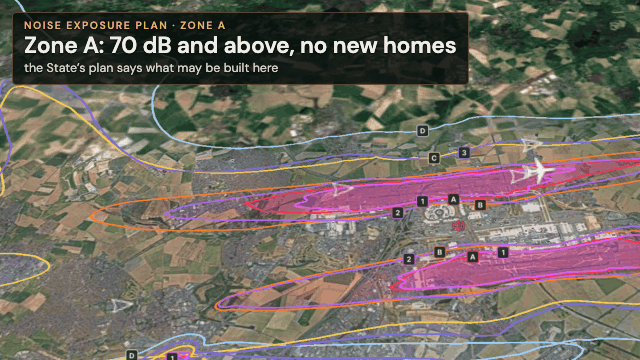

<sub>Secondes 24,9–27,4 du film : la légende est hors cadre et la fiche tenue 1,6 s sur une image. Données : plans d'exposition au bruit de la DGAC, via la Géoplateforme de l'IGN. Imagerie : Google, via Cesium ion.</sub>

</div>

### Lyon : ce qui s'est vendu, et son DPE

Les ventes immobilières (DVF) autour des Terreaux, dont une annotée à 410 000 € ; une ligne balaie le quartier et les ventes laissent place au DPE de chaque parcelle diagnostiquée.

<div align="center">


<sub>Données : demandes de valeurs foncières (DVF), DGFiP via Etalab · diagnostics de performance énergétique (DPE), ADEME. Imagerie : Google, via Cesium ion.</sub>

</div>

### Réseau électrique : la France s'allume

L'Europe de l'Ouest dans le noir ; le réseau haute tension français s'allume et chaque centrale nucléaire élève une colonne à la hauteur de sa production de l'heure. La caméra plonge dans la vallée du Rhône, où chaque centrale affiche sa production et sa puissance, et ouvre la fiche de la centrale de Cruas.

<div align="center">

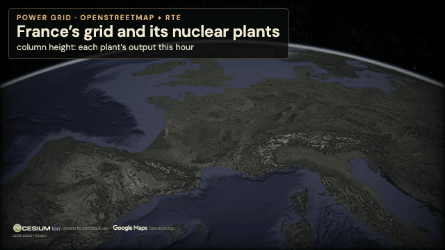

<sub>Secondes 0–3,5 du film, la première image tenue 0,5 s. Données : lignes haute tension, © les contributeurs d'OpenStreetMap · production des groupes, RTE. À cette échelle, le film dessine les colonnes plus larges et trois fois plus hautes que l'application ; leurs proportions sont celles des données. Imagerie : Google, via Cesium ion.</sub>

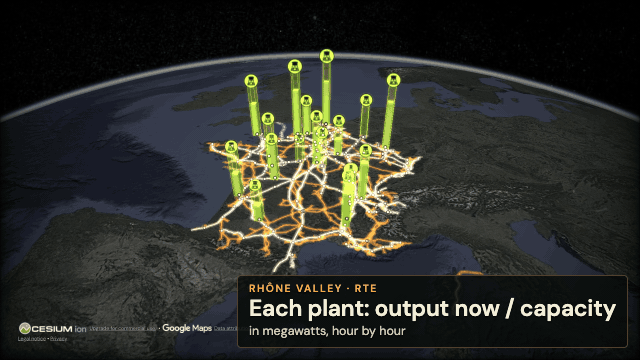

<sub>Secondes 3,5–7,8 du film : la plongée est jouée ×1,5 et les étiquettes tenues 1,8 s ; la légende reste hors cadre. Données : lignes haute tension, © les contributeurs d'OpenStreetMap · production des groupes, RTE · position des centrales, Open Data EDF. Imagerie : Google, via Cesium ion.</sub>

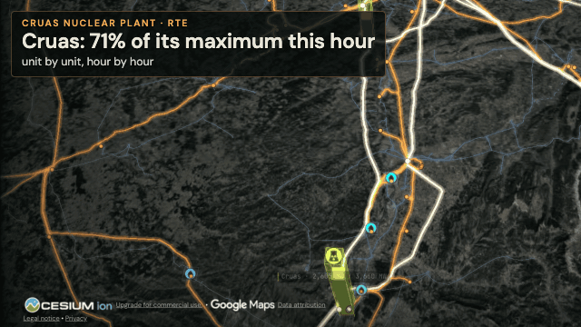

<sub>Secondes 7,4–10,1 du film : la légende est hors cadre, le cadre suit la fiche pendant que la caméra dérive, et la fiche est tenue 1,3 s. Données : production des groupes, RTE (API Actual Generation) · position de la centrale, Open Data EDF. Imagerie : Google, via Cesium ion.</sub>

</div>

### Infrastructure numérique : de toutes les antennes à une seule

L'Europe dans le noir, puis les 72 746 sites d'antennes mobiles de France s'allument ; les Alpes qu'aucun opérateur ne couvre en 4G ; les centres de données d'Île-de-France et leurs mégawatts ; et à La Défense, un mât et le terrain qu'il voit.

<div align="center">

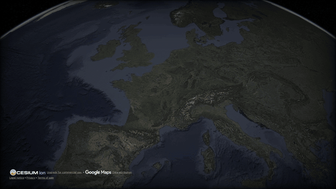

<sub>Données : sites d'antennes mobiles, ANFR. Imagerie : Google, via Cesium ion.</sub>

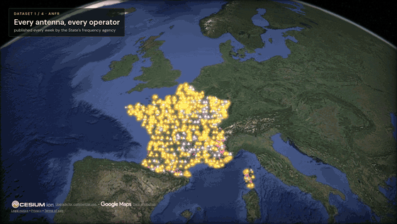

<sub>Données : couverture 4G théorique, ARCEP (Mon réseau mobile). Imagerie : Google, via Cesium ion.</sub>

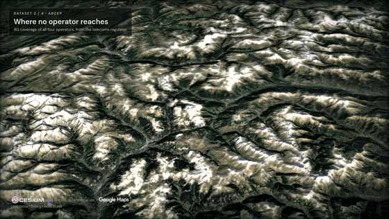

<sub>Données : centres de données, © les contributeurs d'OpenStreetMap et DCWatch · sites d'antennes mobiles, ANFR. Imagerie : Google, via Cesium ion.</sub>

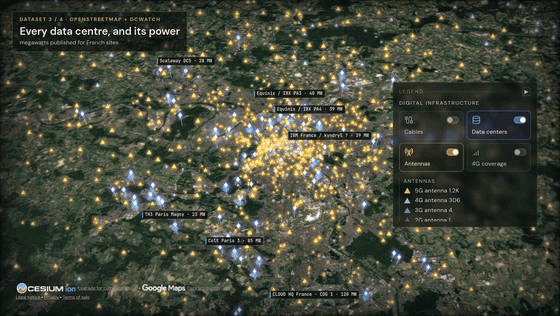

<sub>Données : le mât sélectionné et sa hauteur déclarée, ANFR. L'onde est dessinée pour le film sur les tuiles 3D ; l'application calcule la ligne de vue sur le seul relief et la dessine sur le globe. Imagerie : Google, via Cesium ion.</sub>

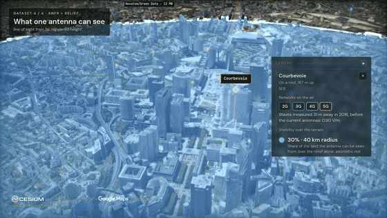

<sub>Données : le mât sélectionné et sa hauteur déclarée, ANFR. Ligne de vue dessinée pour le film sur les tuiles 3D. Imagerie : Google, via Cesium ion.</sub>

</div>

<!-- view 5: Gironde megafire, pending -->

## Le lancer

Node.js 24.14.x ou 26.x.

```bash
npm install
npm run dev -- --host localhost --port 4173
```

Ouvrez **`http://localhost:4173/globe`** (`/` est la page d'accueil). Aucune clé, aucun `.env`, aucune inscription : le globe démarre sur OSM et les fonds IGN, avec toutes les couches 🟢.

Les clés optionnelles (Google Maps ou Cesium ion pour la 3D photoréaliste, OpenAI ou OpenRouter pour la voix, AISStream, NASA FIRMS, TomTom, RTE) se collent dans l'application : la pastille **POWER UP** ouvre le panneau des fournisseurs. Le détail et les coûts sont dans [Keys & Costs](README.md#-api-keys).

## Pour tout le reste

Le [README en anglais](README.md) est la référence : le tableau des 59 couches avec leurs sources et leurs limites, l'agent vocal, le cockpit, les clés et ce qu'elles coûtent, les licences des données. Les contributions se font en anglais ([CONTRIBUTING.md](CONTRIBUTING.md)).

## Le socle

Le globe, le cockpit et l'agent vocal viennent de **[God's Eye View](https://github.com/bilawalsidhu/gods-eye-view)**, créé et ouvert par [Bilawal Sidhu](https://github.com/bilawalsidhu). Les 44 couches ajoutées ici, les registres qu'elles croisent et la discipline de refus décrite plus haut sont l'apport de ce dépôt, qui renvoie ses correctifs en amont.

Code sous **[licence MIT](LICENSE)** ; chaque jeu de données garde ses propres conditions ([DATA_SOURCES.md](DATA_SOURCES.md)).

<sub>Note sur les médias : les captures de cette page ont été filmées dans Surplomb pour ce dépôt par son mainteneur. Elles documentent le projet et ne sont pas des fichiers sous licence MIT : les tuiles 3D photoréalistes de Google, les marques et chaque jeu de données qu'on y voit restent soumis aux conditions de leurs détenteurs, et l'attribution placée sous chaque capture l'accompagne. Voir la [provenance des médias](docs/media/README.md) et les [conditions des sources](DATA_SOURCES.md).</sub>

---

<div align="center">

**🌐 Surplomb. Aucun angle mort.**

</div>
