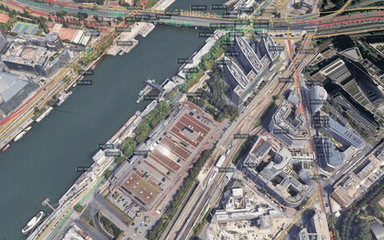

<div align="center">

**English** · [Français](README.fr.md)


# Surplomb

### France, X-rayed. Everything you never thought to look up.

**59 layers of public data on a photorealistic 3D globe — 44 of them written here.** The price the apartment across the street sold for, and the exact parcel that went with it. The building permits granted on the street, and the ones whose construction site is already open. The building's energy rating (DPE), the catchment school, the nearest doctor, recorded crime, aircraft noise overhead, cool islands, what every power plant is producing this minute, and where the buses are.

**56 of the 59 ask for nothing**: no key, no account, no signup. Open the page and France is there.

*No blind spots.*



<sub>Imagery: Google, via Cesium ion.</sub>

Maintained by **[Melvyn Raymond](https://melvynraymond.com/)**.

</div>

---

<div align="center">

**[What it is](#-what-it-is) · [Why](#-why-this-fork) · [Quick Start](#-quick-start) · [First Five Minutes](#-the-first-five-minutes) · [Talk to It](#-talk-to-it) · [What's Live](#-whats-on-the-globe) · [Under the Hood](#-under-the-hood) · [Keys & Costs](#-api-keys) · [Credits](#-built-on-gods-eye-view)**

</div>

---

## 🗺️ What it is

Surplomb is a 3D globe of France that runs in the browser. It puts the registers the French State publishes — property sales, the cadastre, building permits, energy ratings, schools, doctors, recorded crime, power plants, live buses — on one map, next to the live world layers (flights, ships, satellites, public cameras) of the project it forked, [God's Eye View](https://github.com/bilawalsidhu/gods-eye-view). Click a building, a parcel or a bus and its card says what the register says about it, with the source and the date.

It runs on your own machine with no key and no account ([Quick Start](#-quick-start)); the hosted version is [surplomb.app](https://surplomb.app). The code is MIT-licensed; each dataset keeps its own terms ([DATA_SOURCES.md](DATA_SOURCES.md)).

---

## 🌍 Why this fork

**An intelligence globe usually answers “what is moving on the planet?”** Planes, ships, satellites, wildfires. It is spectacular, and it is no use on the day you sign a lease.

**This one answers a narrower and far more useful question: “what is true at this address?”** What the neighbors paid, and for which parcel. What got a permit at the end of the street, and how far along the construction site is. The catchment school, the doctor, the aircraft noise, the flood risk underfoot, how cool the neighborhood stays at 15:00 on a heatwave day. **Almost all of it comes from registers the French State already publishes and that nobody had put on the same map.**

**That is what a French fork has going for it.** French open data is ranked first by the [OECD (2025)](https://www.oecd.org/content/dam/oecd/en/publications/reports/2026/02/digital-government-index-and-open-useful-and-re-usable-data-index_dbe102ed/6347ec74-en.pdf) and by the [EU's Open Data Maturity report](https://data.europa.eu/en/open-data-maturity/2025) five years running, which is why this fork can carry 44 layers upstream does not have.

Three things set this repository apart.

**1. The layers.** 59 on the globe, **44 of them written here** — the base brings 15. Forty of the 44 are French: the cadastre, property sales (DVF), building permits (Sitadel), energy ratings (DPE), local zoning plans (PLU), Géorisques, INSEE's amenity base (BPE), the health facility register (FINESS), Annuaire santé, the ANFR antenna register, EV charge points (IRVE), real-time transit (GTFS-RT), Vigicrues, Hub'Eau, Météo-France, ODRÉ, RTE, IGN BD TOPO. The other four — airports, ports, marine buoys and the power grid — cover the world.

**2. The price of entry.** **56 of the 59 layers need no key** — no account, no signup, no credit card. Three want a free key. All of France displays on a page opened cold.

**3. What each layer refuses to draw.** It is the discipline of this repository, and it shows in the table below. Sitadel prints **its join rate on every card** because that is the whole story — 91.3% in Paris, 7.6% in Toulouse. The 1,744 hydro plants with no coordinate are rolled up to their municipality rather than pinned 2.5 km away. Airport noise **suppresses its unit** when two dates contradict each other instead of guessing. The 682 cool spaces whose published hours had already expired carry the validity window on the same line as the answer. A number that cannot be placed honestly is counted and stated, never put somewhere false. The cartographic rules every layer is checked against are in [docs/CARTOGRAPHY.md](docs/CARTOGRAPHY.md).

The rest — the photorealistic globe, the cockpit, the voice agent, the worldwide layers — comes from the open-source base [credited at the bottom of this page](#-built-on-gods-eye-view).

<details>
<summary><b>How the layer counts are measured</b></summary>

Measured on 2026-09-19 against upstream `main` (`0d41b6be`). This fork registers **60** layers; one of them, Global context, computes the Contacts roster and is entered through that tab rather than the layer panel, which leaves **59 visible**, **56** of them keyless (`auth: 'none'` in `src/data/layerTaxonomy.js`). Upstream registers **21**: 16 are here too, and the five that are not — ALPR cameras, directions, worldwide transit and the two layers of the August 2026 Bhote Koshi flood — were added upstream after this fork branched. **44** registered layers exist only here. The count re-measures in one command:

```bash
git remote add upstream https://github.com/bilawalsidhu/gods-eye-view.git  # once
git fetch upstream main
bash -c 'ids() { grep -oE "id: '"'"'[a-z0-9-]+'"'"'" | sort -u; }
comm -13 <(git show upstream/main:src/data/layerState.js | ids) <(ids < src/data/layerState.js) | wc -l'
```

</details>

> Half the magic is that it looks like a forbidden cockpit. The other half is that every line of code is inspectable.

The live layers are grounded in public feeds: the airliner crossing your screen is reporting telemetry, the camera is installed at a published location, and the ISS position is propagated from current orbital elements. The client deliberately renders flights one polling interval behind real time so it can interpolate smoothly. Some experiences are modeled rather than live: keyless traffic is labeled as a simulation, camera poses are estimated until calibrated, and launch ascent playback is marked `RECONSTRUCTED ESTIMATE`. Each layer keeps its source and freshness state visible, including partial, delayed, simulated, and unavailable states.

---

## 🎛️ What This Thing Does

- **🛩️ Cockpit view:** Ride inside a tracked flight — the camera holds the terrain under you all the way down.
- **📡 Contacts:** A 250 km roster of everything near your target — step through live aircraft and drop into any cockpit.
- **🎯 Click-to-track anything:** Camera locks on, draws a fading trail, surfaces full metadata — and a tracked fire or vessel hands you off to the nearest live camera in one click.
- **🖊️ Voice whiteboard:** Speak annotations onto the world — real boundary polygons, marks, and routes.
- **🛫 3D hangar:** Real per-class aircraft models — 787, ATR-72, Citation, Bell 206, MQ-9 — and a tracked contact swaps from glyph to 3D model as you close in.
- **🎨 Reskin reality:** GLSL sensor looks over the normal globe — CRT, NVG, FLIR/thermal, Night, Snow.
- **🟩 Detection overlay:** Screen-space bounding boxes and IDs on everything in view.
- **🎖️ Military HUD:** Tactical heads-up display with intelligence-style telemetry.
- **🌐 Global Context:** Stage the full situational picture with one switch — and get your exact view back when you leave.
- **🎥 Scene director:** Capture cinematic camera tours for clips and demos.
- **🔗 Share Links:** Camera, style, layers, and even one tracked target serialize into a URL — a live target is a handoff, not a bookmark.
- **🏠 Reset Globe:** One control — or one sentence — back to the full Earth.

---

## ⚡ Quick Start

Requires Node.js 24.14.x or 26.x (enforced by `package.json`).

```bash
npm install
npm run dev -- --host localhost --port 4173
```

Open **`http://localhost:4173/globe`** (`/` is the landing page). **No key, no `.env`, no signup.** Cold start settles in under two seconds on a recent laptop (median 1.86 s in a point-in-time M5/Chrome capture — [docs/PERFORMANCE.md](docs/PERFORMANCE.md); a comparison baseline, not a hardware requirement). A first-visit card asks for an address; sales, building permits and energy ratings (DPE) light up when you land.

Keyless you get the globe on **OSM** worldwide, and over France the **IGN Géoplateforme** basemaps — BD ORTHO® at 20 cm and Plan IGN — plus every 🟢 data layer, which is most of them. Pick a source in the **MAP SOURCE** row of the Visual Presets tray.

To add the photorealistic 3D planet, copy `.env.example` → `.env` and set `GOOGLE_MAPS_API_KEY` — or, if your Google billing address is in the EEA (where Google withholds 3D tiles), a free `CESIUM_ION_TOKEN`, which serves the same Google tileset under Cesium's contract. Everything in this README is color-coded — 🟢 needs nothing · 🟡 free key · 🔴 metered — and Google Maps is the only 🔴 that changes what the planet looks like. Full map in [Keys & Costs](#-api-keys).

The dev server binds to **localhost** — your keys stay on your machine. Sharing on a LAN and the cost rails live in [Keys & Costs](#-api-keys) and [SECURITY.md](SECURITY.md).

**macOS shortcut:** `./scripts/dev-fresh.sh` clears the Vite cache and pulls your keys straight from the Keychain. It runs keyless too, with a warning.

---

## 🕐 The First Five Minutes

No account, no signup. The first-visit card asks for an address — or close it and run this gauntlet yourself. Somewhere in these five minutes it stops feeling like a demo:

1. **Light up the sky.** Turn on **Live flights** yourself in the layers panel — thousands of live aircraft, gliding on real telemetry, detection mesh already reading the scene. Click one: the camera locks on, a trail draws behind it, and its live telemetry card comes up.
2. **Take the controls.** Hit **COCKPIT** on your tracked plane and ride it down, switching sensors mid-flight: NVG into Ironbow FLIR.


3. **Drop into a busy airport.** Search one and descend to the taxiways with **3D** aircraft on — grounded contacts, taxi trails, the whole apron working in real time.


4. **Look through a public camera.** Turn on **Public cameras** over Austin, London, California, or Lyon. The feeds aren't webcam embeds — they project *into* the 3D city. Click the panel preview to blow the frame up full-screen at the publisher's own resolution (most cameras send 1920×1080 into a 360px rail; the bar always prints the real pixel size). Cycle coverage to **VIEWSHED** and every camera draws its estimated coverage volume — where it reaches, and where it goes blind.


5. **Track something in orbit.** Turn on **Satellites** and click the ISS — you ride along at orbital distance, orbit ring and all.


6. **Switch the optics.** Tap `1`–`7` — CRT, NVG, FLIR — and the whole live planet re-renders through a different sensor.


7. **Talk to it** *(needs an OpenAI or OpenRouter key)*: *"Take me to LAX and select the nearest airborne aircraft."*
8. **Come home.** Hit **Reset Globe** — or just say *"zoom out to a globe view."*

**Keyboard:** `1`–`7` visual styles · `H` HUD · `D` detection · `C` cockpit · `Esc` out.

---

## 🛩️ The Cockpit

> Every plane should let you do this.

Real-time cockpit mode, built from live flight data: the camera rides your contact with real terrain holding underneath, all the way down — sensor styles come along for the ride, and **Contacts** keeps the 250 km roster one click away: jump plane to plane and fall straight into the next cockpit.


The cockpit even carries its own briefing strip: nearby live signals, regional headlines, and real local weather — with an opt-in **WX** mode that renders volumetric clouds from actual observations around your aircraft.


*Why cockpit mode exists: you're riding a real aircraft over real terrain — and you get to pick which sensor you see the world through.*

---

## 🎙️ Talk to It

> Voice needs **one key — your choice of two**. Without either, the entire app still runs; the mic button just says which key it wants.
>
> - **OpenAI** — a single speech-to-speech model over WebRTC. Full duplex: you can talk over it. The same key drives the **AI HUD summary**, a terse five-word intelligence-style readout of the current view that regenerates as you move.
> - **OpenRouter** — your browser's own speech recognition and speech synthesis (no key, no download) with a text model in the middle, driving the same 29 tools. Turn-based rather than full duplex, and cheaper: measured **$0.001–0.005 per spoken command** on the default brain. Set `GEV_VOICE_PROVIDER=openrouter`.
>
> The default brain on that path is **Mistral Medium 3.1**, picked on a French routing bench over this app's own tool schemas — 26/26 on tool choice, and the only model in that bench that refused to invent history when handed a thin source document. Any OpenRouter model with tool calling works: set `OPENROUTER_VOICE_MODEL`.

Click the **mic** button, grant the microphone, and just talk. This is more than a voice-controlled remote:

- **🧠 It knows what it's looking at.** The agent pulls live scene context before answering — including coordinates, street names, active layers, and view scale. Ask *"what city is this?"* mid-flight and it knows.
- **🎯 Entity Q&A.** Click any plane, ship, datacenter, bike station, charge point or bus and ask *"what's this?"* It answers using the object's live telemetry — *"how many bikes and docks here?"* is answered from the loaded record, with the time of the last report.
- **🗂️ It knows its own catalog.** All 59 toggleable layers are nameable by voice, in French or English, by id, spoken name or the label on the panel — *"montre les médecins"* (show the doctors), *"les bornes de recharge"* (the charge points), *"vigilance météo"* (weather warnings). Ask *"what layers do you have?"* and it reads the registry; ask for one that does not exist and it offers the closest three instead of guessing.
- **👁️ Visual grounding.** At street level, it reads a viewport screenshot to identify legible signage and building names, and is instructed never to hallucinate labels.
- **🎬 Cinematic framing.** *"Show me the planes overhead"* pulls the camera back, angles it, and frames the live traffic like a director.
- **🔒 Honest and secure.** The agent only confirms actions that succeeded. Your `OPENAI_API_KEY` never touches the browser; the client only gets a short-lived session token.

Twenty-nine tools, four jobs — the commands below come straight from the product's voice test suite and tool playbook:

**🎥 Direct it** — drone-operator camera verbs:
> 🗣️ *"Take me to Tokyo."* · *"Orbit around this area slowly."* · *"Draw the walking route from the Capitol to Zilker Park."* → *"Fly the route we just drew."* · *"Zoom out to a globe view."*

**🖊️ Annotate it** — a whiteboard over the real world:
> 🗣️ *"Outline the state of Texas."* · *"Annotate the Texas State Capitol and its grounds"* — it draws the **actual enclosing boundary**, not a circle. · *"How far is the Eiffel Tower from the Louvre?"* — a connector arrow appears and it speaks the distance. Everything persists until you say *"clear the map."*


**🔎 Interrogate it** — analyst queries against the live layers:
> 🗣️ *"How many flights are over Texas right now?"* · *"Which ships are headed to Oakland?"* · *"What is the biggest fire near Los Angeles?"* · *"Is anything flying above forty thousand feet?"* · *"When does the ISS pass over next?"*

**🎛️ Operate it** — the whole console, hands-free:
> 🗣️ *"Switch to night vision and turn on the flights layer."* · *"Turn on the camera viewsheds."* · *"Play a news radio station near Austin."* · *"Track that plane."* → *"Enter Cockpit."*

**And the rapid-fire tier** — one sentence each:
> 🗣️ *"Show me global infrastructure."* (stages the layers and pulls back to the globe) · *"Play Orbital Watch."* (a full cinematic scene) · *"Set detection density to fifty percent."* · *"Next contact — helicopters only."* (mid-cockpit) · *"Show me space missions."* · *"Switch to Bing aerial."* · *"Sharpen the image a touch."* · *"Switch to the tactical layout."* · *"What's turned on right now?"*


*Ask for radio near anywhere and the globe starts broadcasting — every station is a real place you can fly to.*

---

## 🛰️ What's on the Globe

Fifty-nine layers. **Fifty-six of them need nothing at all** — no key, no account, no signup. Exactly three want a free key: Ships and ports, Generating units and Active fires (FIRMS). Every layer added since is keyless, including the newest — traffic counts, recorded crime, mobile antennas, cool islands, planning permits, airport noise, everyday amenities, and the Gironde fire of July 2026 replayed as three rings of light. (🟢 nothing · 🟡 free key · 🔴 metered.)

| Layer | What you get | Source | Auth |
|-------|--------------|--------|------|
| 🗺️ **Map stack** | Google Photorealistic 3D, Bing aerial, OSM, and over France IGN's 20 cm orthophoto (BD ORTHO®) and Plan IGN | Google / Cesium ion / OSM / IGN Géoplateforme | 🔴 Google, or 🟡 ion, for photorealistic 3D · 🟡 ion for Bing · 🟢 OSM and IGN |
| ✈️ **Live flights** | Thousands of live aircraft + route history | OpenSky + adsb.lol | 🟢 (🟡 optional for more polling credits) |
| 🎖️ **Military flights** | ADS-B military traffic in amber | adsb.lol | 🟢 |
| ✈ **Airports** | Where everything above actually lands — **7,466 airports and airfields**, from Roissy's 4,215 m of asphalt to an 82 m strip at La Tour-du-Pin. Worldwide it draws every large and medium airport plus **everything that sells a scheduled seat**, down to Monaco's heliport and the Greenland shuttles; **in France it draws the whole long tail** — 1,337 fields across mainland and overseas France, altiports, seaplane bases and one balloon field included. Each card carries the ICAO and IATA codes, the class, the longest **open** runway with its surface, and the municipality. **Importance is on the map, not just in the text:** three tiers on one hard question — is a scheduled seat sold here? — *Scheduled-service airport*, *Airport without scheduled service*, *Airfield & flying club* set the color, the label ladder and how far out the card is readable, so a flying club stops taking a label cell from Roissy. The dot **size** is the published runway length, a measurement rather than a bucket, and 3,000 m of it buys a field its own orbital range. Three chips on the row cut straight to the tier you want. **And 418 French fields are drawn on the ground they occupy** — the footprint IGN surveys in the BD TOPO®, joined onto the pack on the ICAO code, which gives a shape to **213 fields that had none**: OurAirports georeferenced 8% of the French flying clubs, and that long tail is the half of this layer no global source answers. The outline is one color for all 418 and stops being drawn under 8 px across, so the mark reverts to a dot rather than to a blob. Bundled with the build, so it draws with no key and no network | OurAirports (public domain) · IGN BD TOPO® (Licence Ouverte 2.0) | 🟢 |
| 🚢 **Ships and ports** | Every ship broadcasting AIS over mainland France and its approaches — from the Ouessant traffic lane to the Dover strait, the Gulf of Lion and Corsica. Each contact carries what its transponder declares: type, name, IMO number and, for those that publish dimensions, the hull drawn at true length and beam. **What it has learned about a ship, it keeps** — identities are cached for 30 days, so a restart no longer re-learns the fleet six minutes at a time. One line of `.env` restores the worldwide box | AISStream | 🟡 |
| 🛰️ **Satellites** | A roughly 840-object core catalog, color-coded by class with a live legend — the **DENSE** chip drops in the whole Starlink shell | CelesTrak | 🟢 |
| 🌍 **Earthquakes (24 h)** | Global seismic activity, last 24 h | USGS | 🟢 |
| ⬡ **Marine buoys** | Live sea state from the NOAA buoy network — wave height, period, sea temperature and wind, colored on the WMO sea-state ladder. Coverage is sparse and labeled that way: only about a fifth of reporting stations carry a wave sensor, and one without one renders neutral rather than calm | NOAA NDBC | 🟢 |
| 🚗 **Road traffic** | Live congestion driving per-vehicle flow at street level — dive below ~8 km and the dots color to real jams. Keyless it's an approximate simulation | TomTom + OSM | 🟢 (🟡 TomTom makes it real — get one) |
| ⚠ **Road events** 🇫🇷 | What the road operators have actually declared — every accident, rockfall, closure, roadworks order and detour the **Directions interdépartementales des routes** (DIR, the State's regional road directorates) publish on the national network, in DATEX II. One marker per *situation*, not per record: an accident and the two lanes it blocked are one incident, with the consequences counted on its card. Yellow roadworks are two thirds of it, which is the honest shape of a road network on an ordinary evening. **Planned is not happening** — the 68 closures ordered for next month are hidden by default and drawn as ghosts when you ask for them — and an event the operator has closed stops being drawn even when its published window never ends. The State-run national road network (RRN **non concédé**) only: the concession motorways are behind a credentialed license and their absence is stated, not hidden. No key | Bison Futé / DIR (DATEX II) | 🟢 |
| 📹 **Public cameras** | ~815 public cameras projected *into* the 3D space — Austin · California (Caltrans) · London (TfL) · Lyon (Métropole de Lyon). Positions are published; poses are estimated priors **you calibrate by dragging a gizmo on the camera itself**. Opt-in `CCTV_OSM_CAMERAS_ENABLED=1` adds OpenStreetMap's mapped camera *positions* for whatever you are looking at (viewport-loaded, worldwide) — no feed, shown as a labeled Street View or placeholder frame | City APIs · OSM | 🟢 |
| 📻 **Radio** | Geolocated world radio with an **analog tuner** — drag the needle across up to 750 stations and the globe flies to each broadcaster | Radio Browser / broadcasters | 🟢 |
| 🚲 **Bike share** | Live station availability — 32 US systems plus Vélib', Vélo'v, vélÔToulouse and Le Vélo (TBM). Each dot is filled by how full the station is and **ringed in its operator's color**, the same color that operator wears on the Shared vehicles layer | GBFS | 🟢 |
| 🛴 **Shared vehicles** 🇫🇷 | Every *other* French shared vehicle: ~40,600 free-floating bikes, e-bikes, e-scooters and mopeds plus ~15,500 dock stations, across 135 operators. **Shape says what it is** — bike, e-bike, e-scooter, moped, car each draw their own silhouette — and **color says who runs it**, one hue per operator nationwide, so Vélib', Lime, Voi and Dott are tellable apart in the same street. Two row chips cut the fleet in half — **Bikes** (mechanical and electric bikes, plus the docks that hold them) and **Everything else** — as a partition, so pressing one and then the other shows everything. Loaded per viewport, de-duplicated against Bike share and against the catalog's own copies of itself | transport.data.gouv.fr (GBFS) | 🟢 |
| 🚌 **Public transit** 🇫🇷 | The first thing on this globe that moves *on the ground*: live buses, trams and coaches across ~150 French networks, gliding between real fixes with line, speed, occupancy and stop status — each one carrying the operator's own **delay, cancellation, skipped stops and line disruption** for the run it is on. **Click one and its line draws** — the route trace in the operator's own color, every stop of the run, and when it is due at each. Loaded for the viewport you are looking at | transport.data.gouv.fr (GTFS-RT + GTFS) | 🟢 |
| 🛣 **Road network status** 🇫🇷 | The State's own loop detectors on the national road network — **1,587 sites, 608 segments, 975 km**, colored by the sixteen DIR traffic centers' live `freeFlow`/`heavy`/`congested` and carrying the one thing TomTom never gives you: a **measured vehicle count**, veh/h and km/h per station. Keyless, so it is the only real congestion data on a build with no TomTom key. **743 of those positions are not published anywhere** — the DIR give an address, a kilometer post, and the layer resolves it against the State's own kilometer-post survey (bornage), which agrees with the coordinates that ARE published to a median of 3.8 m. And every segment is drawn along the **surveyed center of its own carriageway** — the State's own 26 m-resolution survey of the network, joined by the posts each section names — instead of as the chord between its two ends: 411 segments strayed over 25 m from their road, a median 56 m, now 589 of 608 follow the tarmac. That is what lit Nantes, Rennes, Saint-Brieuc and Lorient–Vannes, and all 115 stations of DIR Ouest. Brightest exactly where Public transit is dark — Marseille, Nantes, Rennes, Bordeaux — and blind in Île-de-France and Lille, which it says out loud rather than showing a blank | Bison Futé / DIR (DATEX II) + Bornage & Liaisons RRN | 🟢 |
| 🔥 **Fires** | Two modes, one lit at a time. **Recent detections**: live NASA FIRMS detections, trailing 24 h, worldwide. **Major fires**: past fires replayed on the map — see the next row | NASA FIRMS | 🟡 |
| 🜂 **Gironde · summer 2026** 🇫🇷 | The « Major fires » mode of the row above: what burnt. **July 22 to August 1, 2026**, the largest French forest fire since 1949 — from Saumos into the pine forest behind the Bassin d'Arcachon. The map goes to dusk on the satellite basemap and the camera settles low over the scar: **three zones, each closed by its own glowing outline**, one per group of days (22-23 July in red, 24-25 July in orange, 26 July → August 1 in ivory), each drawn around the ground where satellites first saw the heat arrive, over the **9,524 NASA FIRMS detections** that drew them, each dot in the colour of its days. The last ring is the burnt area Copernicus EMS mapped; EFFIS's final perimeter (37,191 ha) is dashed. A bar under the map **replays the three stages** in 18 seconds, each ring flaring as it closes, and jumps to any stage. A ring shows where the heat arrived, not a flame front — the key says so. No key, nothing fetched: the pack is in the repo | Copernicus EMS · EFFIS · NASA FIRMS | 🟢 |
| 🚀 **Space missions** | Rolling 30-day launches with payload, stage, and recovery detail | Launch Library 2 | 🟢 (🟡 optional token raises the allowance) |
| ≋ **Rivers (Vigicrues)** 🇫🇷 | France's official river-flood vigilance map — 337 monitored reaches, colored green→red by the State's own 24 h risk reading. Calm days are green; it lights up in an episode | Vigicrues (SCHAPI) | 🟢 |
| ◉ **Hub'Eau stations** 🇫🇷 | The live river-sensor mesh under Vigicrues — up to ~4,000 gauging stations, sized by discharge, with the raw number on the label | Hub'Eau / Eaufrance | 🟢 |
| ⚠ **Weather** 🇫🇷 | The 4-color department-level weather warning every French forecast leads with — 9 phenomena, only the departments on alert painted | Météo-France | 🟢 (🟡 optional key swaps the mirror for the contracted API) |
| 🌡 **Weather stations** 🇫🇷 | Where France actually measures the weather — **2,144 stations**, from the tide line to the **Aiguille du Midi at 3,845 m**. Color is capability, not decoration, because a French weather station usually is not one: **1,254 of the 2,144 — 58% — measure temperature and rain and nothing else**, only 845 can tell you which way the wind is blowing, and 234 have a barometer. Pressing **WIND** deletes 60% of the map. A ring marks the **190 stations that publish their readings in the open** — Météo-France's own SYNOP list names 62 — and a click brings back the last hour plus the station's records *with the period they stand in*: 42.4 °C at Toulouse-Blagnac in 2023, against observations back to 1947 | Météo-France (real-time network · SYNOP · climatological station sheets) | 🟢 |
| ⚡ **Electricity mix** 🇫🇷 | Where French electricity actually comes from, right now: the 12 mainland regions painted by whether they *power* France or *draw* on it — Auvergne-Rhône-Alpes and Normandie exporting hard, Île-de-France importing almost its whole load — plus the five border flows as arcs pointing the way the power travels. Updated every 15 min | éCO2mix — RTE, via ODRÉ | 🟢 |
| ⬡ **Gas network** 🇫🇷 | The French gas system as three things at once: **36,106 km** of high-pressure transmission trace clamped to the ground — NaTran (ex-GRTgaz) in violet, Teréga in orchid, never merged — plus the **850 renewable-methane injection points** feeding it and the **14 gas-fired power stations** burning out of it, into the `gaz` source of the Electricity mix layer above. Both traces are the operators' own, simplified to about 250 m, and are drawn exactly as published | NaTran / Teréga / ODRÉ | 🟢 |
| ◈ **Power plants** 🇫🇷 | Where French electricity is physically made: EDF's own 79 generating sites — 18 nuclear (61,370 MW), 51 hydro (13,779 MW) and 10 fossil-fired (4,945 MW) — each a mark whose **area** is its installed capacity and whose **plate** carries a punched silhouette of its generation type — a cooling tower, a water drop, a flame — labeled with what it actually is: `GRAVELINES · 5 460 MW · 6 réacteurs`, `GRAND-MAISON · 1 714 MW · pompage-turbinage mixte`. The row filters it: one generation type at a time, then that type's own categories (the reactor series, the water regimes, the fuels). EDF's fleet rather than France's, and dated per file rather than pretending to one snapshot | EDF Open Data | 🟢 |
| ☢ **Generating units** 🇫🇷 | France's power stations, **unit by unit**, at the output RTE last published for each one — 57 reactors, 6 pumped-storage machines, 44 thermal groups, 171 units and 93.5 GW in all. Each station is a ring sized by its nameplate, filled by what it is producing: a **crisp empty ring is a reactor in outage**, a faint one is a station RTE said nothing about, and a **magenta disc is a machine consuming the grid** to fill its upper lake. Click one and the card lists its groups with a day of hourly history each. Draws the whole fleet with no key at all — the key only adds the megawatts | RTE · ODRÉ · EDF · OpenStreetMap | 🟡 (🟢 without the key: installed capacity only) |
| ≈ **Hydro plants** 🇫🇷 | The other 2,686 hydro plants. France's national register holds **2,742 hydroelectric installations for 26.02 GW** — the two layers above could draw 56 of them, because one is EDF-only and the other stops at RTE's 100 MW publication floor. Between them sat the nine SHEM plants of the Ossau valley at Laruns, 223.9 MW in one municipality, on no layer at all. This draws the register whole, down to a 40 kW mill. **A filled disc is a plant where it is** — 589 of the 998 positions are a building footprint **surveyed by IGN**, the data the Plan IGN is drawn from, median span 32 m, with IGN's own accuracy on the card. **A hollow ring is a municipality, not a plant**: the register publishes no coordinates, and for the 1,744 installations nobody places, the municipality center is a median 2.5 km from the powerhouse, so they are rolled up rather than pinned somewhere false. Half the register is anonymized by the publisher, and those cards are still full: power, technology, head, connection voltage, source substation, grid operator, and the energy actually injected over twelve rolling months. No key | IGN BD TOPO · ODRÉ · OpenStreetMap · EDF | 🟢 |
| 🔌 **EV charging stations** 🇫🇷 | Every public EV charge point (IRVE) France has declared — 231,079 of them on 2026-08-27, a file rebuilt daily — answered at the scale you ask: the 96 **departments** with the whole country in view, a **thinned mesh** of real positions once it is cropped, then **every site** over a city with its operators and connectors. The car park under La Défense that files 127 separate "stations" is one dot; the 7.5% of charge points two operators publish twice are counted once, and both figures are on the card. Installed capacity, never availability — the register does not publish it | transport.data.gouv.fr / ODRÉ | 🟢 |
| 🎓 **Schools** 🇫🇷 | Every school France registers — 68,939 rows on 2026-09-01, rebuilt daily, of which **68,158 are open and placed** — answered at the scale you ask: the 96 **departments** with the country in view, a **thinned mesh** of real positions once it is cropped, then **every establishment** over a city with its level, its roll, its services and **its social position index (IPS)**. Colored by level, sized by pupils joined on the UAI (the national establishment code) from the ministry's four enrollment files. The 8.3% with no published roll are drawn and say *roll not published* — a gap in the roll files is not a school with no pupils. The DEPP's *indice de position sociale* is joined the same way, from four more files read at four DIFFERENT school years (primary schools 2024-2025, the rest 2025-2026), and it changes neither the color nor the size: **40,529 of the 62,857 schools that could carry an index have one (64.5%)**, and the third that do not say *IPS not published* rather than sitting in the middle of a ramp — including the 2,504 the DEPP marks `NS` because they are too small to publish. A high school's card names the tracks its establishment index blends, because on the 931 general-and-vocational high schools (LPO) that publish both, the general/technological and vocational tracks are 18.1 points apart at the median and 47.7 at the widest. The 2,159 schools geocoded only to their municipality say that too, and the 2,762 the mainland polygons cannot paint are counted on the national card rather than quietly missing | Annuaire de l'éducation — MENJ · IPS — DEPP | 🟢 |
| 🏛 **Higher education** 🇫🇷 | Where France's **2.96 million students** actually are — the layer that starts where the one above stops. The Annuaire de l'éducation ends at the baccalauréat: not one of its eight establishment types is a university, an IUT (university institute of technology), an engineering school, a business school, a nursing school (IFSI) or a school of architecture, and **3,492 post-bac establishments appear nowhere in it**. This draws the MESR's own enrollment register — **6,294 establishments, 6,914 sites**, colored by seven bands folded from the ministry's 14 categories and sized by the students counted at that campus. The 96 **departments** with the country in view, shaded by STUDENTS rather than by dots (the top ten hold half of French higher education; by site count they hold a third), then **every site** below that — no thinning and no sampling, because the whole register is 0.62 MB gzipped with every name on it. 1,665 establishments carry no coordinate; 977 are placed from the ministry's Parcoursup cartography where it gives exactly one point, and say so on their card. The 688 neither file can place are counted, never invented | Effectifs d'étudiants inscrits · Cartographie Parcoursup — MESR | 🟢 |
| 🧸 **Early childcare** 🇫🇷 | Where there is a place for a child under three, and where there is not. **There is no open national register of daycares** — the Cnaf publishes 210 datasets and not a single facility, FINESS holds only 183 of them by accident, INSEE's BPE stops at 2021 on the API side, and filtering the SIRENE register on the company's NAF activity code makes **the whole public sector** disappear. So this layer draws the indicator the State actually publishes: **places per 100 children under 3**, at the Cnaf's three scales, **all three as territories** — 96 departments as flat fills, then the 1,250 intercommunalities (EPCI) and the 1,061 municipalities filled for real, from the municipal outlines of geo.api.gouv.fr. An intercommunality has no published outline: it is painted as its member municipalities, under a single color and with no inner border, and the municipalities the Cnaf details are cut out inside it, so that no patch of ground carries two figures. The color is a **ratio to the national average** (60.9), not a quantile, so that it means the same thing at every zoom. Each card gives the five modes of care that make up the rate and which one dominates: the Vendée is at 85.7, but through childminders, not daycares. The 6 overseas territories the mainland polygons cannot paint are **all below the average** — Guyane at 22% of the French average — and are counted on the national card rather than lost | Cnaf · geo.api.gouv.fr | 🟢 |
| ✚ **Health & emergency services** 🇫🇷 | Where doctors are, and where access runs out — **64,232 practice addresses and 117,922 named doctors**, with what each of them charges. **The register publishes not one latitude**: the CNAM's *Annuaire santé Ameli* names its address block `coordonnees_*` in the sense of *contact details*, so every dot is geocoded against the national address database (BAN) — 99.4% placed, and the 716 that reach only a municipality center say so. The national view paints the DREES's **local GP accessibility (APL)** rather than a headcount, because the median French person lives 0.7 km from a GP and a map of counts would say “France is covered” and be useless. What is scarce is capacity. Beside them, on the same row, the **186,118 defibrillators (AEDs)** of the national GeoDAE base — a chip, because "where is the nearest one" is not a question anybody asks a globe, and "what can a passer-by reach here" is. It is plugged from a manifest (`datasets/defibrillateurs-geodae.json`), not from code | Annuaire santé Ameli — CNAM · APL — DREES · GeoDAE — Atlasanté | 🟢 |
| ▦ **Cadastral parcels** 🇫🇷 | The lines France taxes land along — the **Plan Cadastral Informatisé** (PCI, the digital cadastral map), one polygon per parcel, with its section, its 14-character national identifier and the surface the DGFiP has registered against it. Two things nobody else draws. **How approximate each line is**: every parcel belongs to a sheet, and the sheet publishes the scale it was drawn at — **1:250 in central Strasbourg, 1:5000 over the Landes forest**, so the same word "boundary" means ±0.13 m in one place and ±2.5 m in another. That spread is the color of every parcel and a line on every card. And **the holes are the streets**: the cadastre parcels private land, not the public domain, so a correct answer over Lyon's Presqu'île covers **45.7%** of the view against 98.6% of a Landes forest block — the row reports the fraction so the gaps read as the public realm. A fiscal document, never a legal one: the card ends by saying so, because in France a property limit is fixed by a surveyor's boundary marking (bornage) and by nothing else | IGN Api Carto (PCI vecteur, DGFiP) | 🟢 |
| 🚦 **Traffic counts** 🇫🇷 | The only road layer here that has actually **counted a vehicle**. Paris publishes every hourly reading its permanent loops take — **27,772,889 of them** — and this draws the last complete week of them on the arc that measured it: **2,977 arcs, 500,136 readings**, colored by mean vehicles per hour and carrying the street's own 24-hour rhythm on its card, weekday against weekend on one shared scale. **It is not live and never says it is**: the feed is a nightly batch that lands the day before yesterday, so the unit is the last complete Monday–Sunday week, discovered from the data's own newest hour. The number that matters most is the one the city does not advertise — **891 of the 2,977 arcs measured nothing at all**, 724 of them declared *invalide* (invalid), and they are drawn as silent rather than given the quiet end of the scale, because "no measurement" and "measured, and empty" are not the same street. A further 356 report occupancy but no count, and the 31 arcs that publish no geometry are reported rather than placed somewhere false | Comptages routiers permanents — Ville de Paris | 🟢 |
| 🚓 **Recorded crime** 🇫🇷 | The SSMSI's own municipality and department bases — **34,920 municipalities, 101 departments, 15 indicators, 2016–2025** — drawn with the publisher's caution rather than around it. **The point of this layer is what it refuses to draw.** At department scale there is no secrecy at all: 17,711 published cells, 469 zeros, **zero suppressions**. Zoom to municipalities and the map goes dark — the SSMSI withholds any count small enough to identify someone, and for the indicators people actually cite that is **most of France**: 69.8% of municipalities for fraud (*escroqueries*), 69.4% for burglary (*cambriolages*), 67.9% for criminal damage (*dégradations*). A withheld cell gets its own color, is never binned, never averaged, never interpolated across, and never colored as "low" — because *nobody published a number* and *the number is small* are different sentences. And this is **recorded** crime: it counts what police and gendarmerie registered, which tracks reporting habits and force presence as much as offending. Every card says so | Bases statistiques de la délinquance enregistrée — SSMSI | 🟢 |
| 📡 **Mobile antennas** 🇫🇷 | The 72,700 mobile antenna supports the ANFR publishes every week, colored by the generation that **actually transmits**: 5G 50,148 · 4G 18,698 · 3G 127 · 2G 89, and 3,638 that transmit nothing at all. An approved project is not a mast — 66,508 of the 826,418 rows (8.05%) are authorizations, drawn as a hollow ring and never as a generation. Size = number of operators (36,671 masts carry one, 11,012 carry four, a single one carries five). A thinned heat mesh of 1,100 to 2,200 points while the view spans more than 0.32°, then every support with its card. The card links to Cartoradio: address, owner, frequency bands per transmitter and the nearest published exposure measurement, with its date — the one for support 449714 reads 0.0 V/m and dates from 2009, sixteen years before the last equipment was installed. Civil aviation, Defense and the Interior ministry are excluded by law | ANFR (data.anfr.fr, Cartoradio) | 🟢 |
| 🌳 **Cool islands** 🇫🇷 | Where Paris says you can get out of the heat — and how much of that is true at the hour you ask. Four registers on one screen: **535 cool islands (îlots de fraîcheur)**, **984 cool green spaces** as real footprints, **1,323 drinking fountains** with a live availability flag, and the **219,432 trees** of the city, loaded for the block you are standing in. The equipment list is not a list of parks — it is **127 permanent shade structures, 125 places of worship, 87 misting stations, 65 museums, 39 swimming pools, 19 town halls, 17 public baths, 16 libraries**: a church is on it because five meters of limestone holds last night's temperature, so the color says the MECHANISM and not the building type. The parks are colored by a **measured** canopy metric — the share of ground under vegetation taller than 8 m at the 2024 survey — and not by area, because area says how big a park is and this says how much of it is in shade at three in the afternoon. **The finding is the asymmetry: only 23 of the 984 stay open during a heatwave**, 9 of them round the clock, and **11 of those 23 have no measured canopy at all** (median 0.028 against 0.320 across the register) — eight are planters, five of them on the Porte Maillot roundabout. The timetables are dated too: **682 of the 984 publish hours whose own validity window had already expired**, 638 of them the same *du 01/05/26 au 31/08/26* (May 1 to August 31, 2026), so every card carries the window on the same line as the answer. Open/closed is recomputed on **Europe/Paris every minute** rather than at fetch time — 757 spaces are open at 14:00 and 367 at 01:30. And a `hauteurenm` of 0, on **19,407 trees**, means *not surveyed*: those dots are gray and never scaled | Ville de Paris & Eau de Paris (opendata.paris.fr) | 🟢 |
| ⌂ **Planning permits** 🇫🇷 | What is about to be built on this block — the register's live end, where Sitadel below is its national history. Permits granted, construction sites open, and, in the three metropolitan authorities that publish their own counter (Paris, Bordeaux, Nantes), the applications **still under review this week**. Color is WHERE IN THE PIPELINE an application sits and never the size of the project: a file under review can still be objected to, an open construction site is already making noise, a completed one is history — three different facts about the same street, and the one a reader cannot get anywhere else. **Outside those three there is not one pale dot**, because the national register contains granted permits only, by construction; that is a property of French open data and not of a calm neighborhood, so the summary says it rather than letting the absence read as calm. Where a permit is about a building that stands, the BD TOPO volume takes the marker's color; where it is about bare ground nothing is painted, because *this application is about THIS building* would be false twice over. No key | Sitadel — SDES + the metropolitan authorities' permit portals | 🟢 |
| 🏗 **Planning permits (Sitadel)** 🇫🇷 | The only forward-looking layer here — not what was built, what has **permission** to be. The State publishes every authorization France has granted since 2013, **3,020,749 of them across four files**, and not one carries a coordinate: 94 columns on the housing register, 33 on the demolitions, and `geoFields: ["REG","DEP"]` on both. What it does carry is up to three **cadastral references** per permit — and this globe already draws cadastral parcels. So a permit becomes the exact plot it was granted for, and the color is where the pipeline has got to: `Autorisé` (granted, nothing reported since), `Chantier ouvert` (construction started: a DOC filed), `Travaux achevés` (completed: a DAACT filed), `Annulé` (canceled), and demolitions in their own red. Three real dates, not one. Dot size is **dwellings created**, capped at 200 — Nantes' biggest permit makes 553. **The join rate is on every card, because it is the whole story.** Measured over six municipalities: Paris 91.3%, Nantes 75.6%, Ustaritz 55.1%, Beaupréau-en-Mauges 54.5%, Marseille 20.1%, **Toulouse 7.6%** — 9,744 of 21,271 in all, against the 44.8% DREAL Auvergne-Rhône-Alpes managed on the same data. Two different failures, kept apart: a parcel is **divided and renumbered precisely when somebody builds on it**, so 2013 places at 60% in Nantes and 2026 at 97%; and Toulouse publishes **46 section prefixes** that Sitadel has no column for, so 34 parcels answer to one reference — those are declared ambiguous, never resolved by picking the first. The plot's declared surface **audits** the join independently and ranks the municipalities the same way (Paris 98.4% agreement, Toulouse 51.5%). Nothing is ever moved to a municipality center. One municipality at a time, because DiDo scans an 889 MB CSV in ~4 s per query and refuses a fourth simultaneous request | Sitadel — SDES/CGDD + cadastre Etalab (DGFiP) | 🟢 |
| Ⓜ **IDFM network and frequency (Paris)** 🇫🇷 | Paris and the Île-de-France as its operator publishes it — every stop and line of the region's network, loaded for the view, and **the first time-of-day dimension in this application**. `transit-fr` is live GTFS-Realtime and consumes zero IDFM data, because IDFM publishes no vehicle positions at all — 0 in Paris intra-muros against 453 in Bordeaux. `idfm-network` draws 37,956 stops as a referential: it can say WHAT serves a stop, never HOW MUCH. Four module headers here refuse to load `stop_times.txt`, and rightly — IDFM's is 747,381,712 bytes over 8,593,005 rows. So this draws the fold **IDFM already published**: 1,311,578 rows of average departures per stop, per line and per one-hour band, Licence Ouverte 2.0 against the network layer's ODbL. Scrub the clock and one number moves on every dot. Measured on an average Tuesday in a 4 km box on Châtelet — 805 stops — **115 of them run more than 32 departures an hour at 08:00 and exactly 1 still does at 22:00; at 01:00, 397 of the 805 run nothing at all**. Saint-Lazare is 37/h at 08:00 and 8.7/h at 22:00. Above the rooftops the same ladder in the same unit fills eight departments: Paris runs **13.22 departures per hour per stop at 08:00 against Seine-et-Marne's 3.00**, and at 22:00 **7.13 against 0.61** — the gap more than doubles after dark. The operating day is 04:00→03:59, so the night bands are numbered 24 to 27 and are kept: region-wide, band 25 is 15,904 trips on a Monday and **31,585 on a Friday**. What is refused: the **549 stops (1.50%) that publish no coordinate** are counted and never placed, though they carry 2.76% of a Tuesday's trips; the eight departments outside Île-de-France hold **235 stops between them** (the Marne has 1) and their polygons stay unpainted; and the **542 of 35,953 stops whose published code and IGN outline disagree** are reported rather than silently repartitioned | Île-de-France Mobilités — network (ODbL) and average weekly service outside school holidays (Licence Ouverte 2.0) | 🟢 |
| 🔊 **Airport noise** 🇫🇷 | The State's own aircraft-noise plans, read under the point the camera is looking at — and the one layer here whose whole job is to REFUSE to guess. **224 aerodromes** carry a noise exposure plan (*plan d'exposition au bruit*); probed at each one's own published point, **215 answer with geometry and 9 do not** (three of them — Toussus, Coulommiers, Pontoise — answer nothing at any scale: an arrêté exists and no polygon does). Two traps decide the whole design. **THE UNIT IS NOT ALWAYS DECIBELS**: France replaced the *indice psophique* with Lden in 2002 and the register keeps both eras in the same two columns — measured over the 298 zone rows returned, **75 are psophique (78–96) and 223 are Lden dB(A) (50–70)** — so the unit is taken from the LATER of `date_arret` and the date inside the arrêté PDF (Gap publishes 1985 on a plan reissued in 2017), and where the two disagree the unit is SUPPRESSED rather than guessed. **AND ONE PROBE IS NOT ONE ZONE**: 74 of the 215 answering probes — **34%** — return more than one polygon for one pixel, so the layer ranks them and says which clause won on the card. A zone the point is not INSIDE is dashed and can never be the answer; where two zones of one plan really do overlap (Saint-Cyr publishes A over B with no hole between them) the **strictest** wins, because that is the rule that applies; where two airports meet (Le Bourget's zone A under Roissy's zone D) both are named. **Aircraft only**: there is no strategic noise map on the Géoplateforme — all 915 layers, and the only four that mention noise (*bruit*) are these — so road, rail and industrial noise are absent and every card says so | DGAC via the Géoplateforme | 🟢 |
| 🏪 **Everyday amenities** 🇫🇷 | The 95,406 points where you find the seven things everyday life actually touches, folded from 126,859 rows of two registers: 30,215 general practitioners · 19,354 food shops · 19,216 pharmacies · 16,832 La Poste counters · 3,953 gendarmeries and police stations · 3,625 swimming pools · 2,211 hospitals. **No schools**: `schools-fr` already draws the 68,158 establishments of the ministry's register and the BPE does not even have a UAI column — its 79,743 "education" rows are refused, and the legend carries the line that says so. A point the register admits it invented is not drawn: 1,284 BPE rows at a "random position within the municipality" and 898 FINESS rows geocoded to the ADMIN-EXPRESS centroid are counted and never placed, plus 170 with no coordinate, **100 of which are all of Mayotte's everyday amenities**. The dot's size is not a quantity — neither register publishes a magnitude — it is a legibility rule; what you read is the position accuracy (sand halo) and the number of establishments at the address (up to 146 doctors on a single point in Paris 14th). National view: the share of the department's municipalities where at least one of these amenities is found — 43.7% of the 34,778 municipalities, from 21.6% in the Gers to 100% in Paris | INSEE (BPE 2025), FINESS (ARS/ANS) | 🟢 |
| ▤ **3D buildings** 🇫🇷 | The buildings themselves, extruded from **IGN BD TOPO®** vector tiles for the viewport you are looking at, colored by use and seated on their own NGF-IGN69 altitudes rather than floated on the ellipsoid. A refused tile is not an outage, and the layer says which it is | IGN BD TOPO® (Géoplateforme) | 🟢 |
| ◷ **Cycling pulse (typical week)** 🇫🇷 | One typical week of cycling in **Lyon and Paris**, hour by hour, from the two cities' own archives — and the two cities cannot be drawn the same way, which is the finding. **Lyon publishes 3½ years of Vélo'v dock availability; Paris publishes no Vélib' archive at all** — not on opendata.paris.fr, not on data.gouv.fr, not through the national access point, and the community mirror everyone cites died in 2023. So Lyon is read as **stocks** (how full each of 422 docks is) and Paris as **flows** (how many cyclists pass each of 111 counters), and every card names which. Press **WEEK** and 168 hours run in 37 seconds: the morning peak fills, the city drains, the weekend flattens. Color is each site's share of its own weekly maximum — the only thing that means the same in both cities | Métropole de Lyon · Ville de Paris | 🟢 |
| ▩ **Territory (INSEE 200 m grid)** 🇫🇷 | Who actually lives there, at four zoom levels — **regions, departments, then INSEE's Filosofi grid at 1 km and 200 m**. Pulled back over the country you get one disc per department on INSEE's own 2023 aggregates (median standard of living, poverty rate, D9/D1, Gini, and the **2024** private-sector wage — the only 2024 income figure INSEE publishes with a geography); zoom in and the **2,314,836 squares of 200 m** take over — at **vintage 2021** when a local pack is built (`npm run filosofi:pack-2021`, from INSEE's own CSV), otherwise the Géoplateforme relay's 2019. The year travels with every answer and is printed on every card, never assumed. It is a **different dataset, not the same one from further away** — a median where the grid has a mean, people where it has households, 2023 where the relayed grid is 2019 — and every card says which one it is on. Each cell carries one flat translucent **disc**, never a tile and never a tower: **color is the indicator you pick; the disc's AREA is the count it was computed on**, in **six national size classes** measured the way the color bands are — because “€27,100 per person” has no extent, and the eye reads extent as quantity. **A symbol never covers more than 36% of its cell and is drawn at 70% opacity**, so the streets, the labels and every other layer stay readable both around it and through it — the whole point of the redraw. Eight indicators recolor the city without a single new request, on **absolute national bands** measured over 80,105 grid cells at 200 m and 6,727 at 1 km, so Neuilly and Roubaix are not the same picture. **Rings are imputed** — INSEE models a cell rather than publishing it when the observation would break confidentiality, 39% of cells carry that flag, and the ring is grown to keep the area its hole costs it | INSEE Filosofi (Géoplateforme) | 🟢 |
| ⚠ **Risks (Géorisques)** 🇫🇷 | What the State has recorded as dangerous about one spot — classified industrial facilities (ICPE), contaminated sites, radon potential, ground-movement and flood exposure, fanned out over Géorisques' own endpoints for the address you scan | Géorisques — BRGM / MTE | 🟢 |
| € **Property prices** 🇫🇷 | What the ground around you last sold for, from the State's own **Demandes de valeurs foncières** (property sales, DVF) — price, date, surface and type per transaction, the parcel it bought washed on the ground under it, filterable to apartments or houses | geo-DVF — Etalab / DGFiP · cadastre Etalab | 🟢 |
| ≈ **Property valuation** 🇫🇷 | The only thing on this globe that never happened: an estimate. It answers an address with a price band built from the DVF sales around it — and then draws those sales beside it, so the number is auditable on the same screen instead of asserted. The subject wears the address **target** and never the register's **€**: shape says WHICH REGISTER a dot comes from, and dressing an estimate as a transaction would be worse than the confusion it avoids. The comparables' three classes sit **ΔE76 31.6 or more from every color of the DVF ramp** and 56.6 to 72.3 apart from each other, so with both layers on it stays visible that two different questions are being answered over the same roofs. No key | Surplomb estimate — DVF comparables (Etalab / DGFiP) | 🟢 |
| ▤ **Energy rating (DPE)** 🇫🇷 | The **energy ratings (DPE)** of the buildings around a point — ADEME's observatory of existing dwellings: letter grade, consumption and emissions, queried by distance | ADEME — Observatoire DPE | 🟢 |
| ▦ **Planning (PLU)** 🇫🇷 | What may be built on the ground under the cursor, from the local zoning plan (PLU). **Click anywhere on the map, not on a marker**: the zoning wash, an outline, or the bare globe between them all answer for *that spot* — which zone, what the family means, which easements reach it, and under which approved document. Four different ways to have no zoning are said apart, because three of them are the layer's own limits rather than facts about the plot | Géoportail de l'urbanisme (APIcarto) | 🟢 |
| ◎ **Catchment area** 🇫🇷 | The ground you can actually reach from a point — **5, 10 and 15 minutes**, cut by IGN's own Valhalla engine over the BD TOPO road and path network, not drawn as a circle. From place Bellecour the walk stops dead at the Rhône and the Saône except where a bridge crosses, which is the whole argument: **2.19 km² on foot against 32.41 km² by car** from the same doorstep. Each ring reports the radius of the circle with the same area — the honest version of the number you were going to use anyway — and the **expansion** between rings, measured against the ×4 that open ground would give, so a place that frays at its edges and one that opens up read differently. **Click the map to pin the center**, and the catchment stops following the camera — the map then flies to the altitude that fits the shape it just measured, centered in the part of the screen no panel is covering, with its card hung off the shape's lower edge and titled with the address of the point you clicked. **Cycling** is measured too, on the OSM cycling network through OSRM, because IGN publishes no cycling profile at any resource: it is an **envelope over 36 directions**, drawn dashed and reported as a majorant, never as the exact polygon the other two are | IGN Géoplateforme (Valhalla / BD TOPO®) · OpenStreetMap / OSRM (FOSSGIS) | 🟢 |
| ⌖ **Site report** 🇫🇷 | The one card a geomarketing tool exists to print, and the only layer here that fetches nothing of its own: it JOINS four that are already on this globe — the reachable shape, the INSEE grid, the PLU and DVF — around a clicked door. **The headline is a bracket, not a number.** A 200 m square sits inside the ring, outside it, or across its edge; every commercial tool picks a convention and prints one figure, and this one prints the centroid count with the two countable bounds around it. Measured at place Bellecour, ten minutes on foot: **9,703 residents, between 5,643 and 15,694** — because at that resolution 24 of the 35 squares the ring touches ARE its border, and the card says so. Never areal interpolation: scaling a square by the fraction inside assumes people are spread evenly across it, which is exactly what INSEE's own imputation flag exists to deny | IGN · INSEE · GPU · DGFiP | 🟢 |
| ⚖ **Comparables (agent's selection)** 🇫🇷 | The valuation dossier, and the only layer here whose data you supply. Pose the property, retain the DVF sales around it from the list the panel offers, key in the listings you are looking at — and read what a valuation opinion (*avis de valeur*) is actually made of. **An asking price and a completed sale are never averaged together**: two medians, two silhouettes on the map (the euro sign for a sale, a price tag for a listing), and the gap between them printed as its own line, with both sample sizes beside it and the sentence that says what it is not — different properties, different dates, no temporal adjustment, so not a negotiation margin. The estimate is a **quartile range** on a named sample and is refused below three comparables. **Nothing is scraped and nothing is bought**: a listing's URL is stored as a link the app never requests — the competitor's own translation file says its comparables are “your adviser's selection from the listing portals”, so a selection screen is the state of the art, not a shortcut — and the dossier stays in the browser that typed it: prices, surfaces and links are never transmitted, only the address you type (to the geocoder) and the property's position (to DVF) | DGFiP DVF · entered by the agent | 🟢 |
| ⚓ **Ports** | The world's port catalog as the U.S. NGA publishes it — Pub. 150, the *World Port Index*, **2,951 ports** bundled so the layer answers on a first boot and offline. No key | NGA World Port Index (Pub. 150) | 🟢 |
| ▣ **Digital infrastructure** | Datacenters: where the compute actually sits — **4,638 sites**, and the file is BUILT rather than extracted. OpenStreetMap maps 4,351 of them worldwide and says nothing about power; DCWatch publishes the electrical power of 520 French sites and no geometry. The merge pins **53** OSM features to a DCWatch row — 51 of them gaining a power figure, the OSM tags never edited — and appends the **287** operating French sites OpenStreetMap has never mapped. Both halves stay ODbL. No key | OpenStreetMap (`telecom=data_center`) + DCWatch / Hubblo | 🟢 |
| ▰ **Dams & levees** | **6,840 structures — and 6,771 of them are in France**: dams AND levees, extracted whole from OpenStreetMap on 2026-09-01. The pack this fork inherited held 704 features for the entire planet, **44** of them French, so this was a row you switched on to watch nothing happen. The rest of the world keeps that older Open Infrastructure Map snapshot, 69 outlines, and the taxonomy declares `coverage: 'fr'` so the layer never claims a set it does not have. No key | OpenStreetMap via Overpass + Open Infrastructure Map | 🟢 |
| ≋ **Submarine cables** | The **712 cable systems** and **1,917 landing points** that carry the internet between continents. ⚠️ **The one bundled dataset that blocks a commercial use of this repository**: TeleGeography licenses it CC BY-NC-SA 3.0 — NonCommercial and ShareAlike. If you charge for something built on this, set `GEV_NONCOMMERCIAL_SOURCES=off` (the server then refuses the files and the layer is withheld), delete `cable-geo.json` and `landing-point-geo.json`, or buy a license from TeleGeography; [NOTICE.md](NOTICE.md) carries the full carve-out. No key | TeleGeography — submarinecablemap.com | 🟢 |
| ⌁ **Power grid** | The wires themselves — the high-voltage network as OpenStreetMap has mapped it: all of France at once from a pre-built national pack (the 400/225 kV backbone from space, the 63/90 kV mesh below 600 km), then the exact routes loaded for the viewport you are looking at. Routes colored by voltage band (**400 kV** backbone down to **63 kV**), the **substations** they land in sized by the same band, and, once you are close enough for a pylon to be a thing rather than a dot, the **pylons** holding them up. Underground cable is dashed, because it has no pylons. This is the one part of the grid RTE publishes no geometry for, so it is volunteer mapping — and only what OSM has given a voltage of 50 kV or more | OpenStreetMap (Overpass) | 🟢 |
| 🎖️ **Military sites** | Viewport-bounded military-site context from community mapping — incomplete by nature, and labeled that way | OpenStreetMap | 🟢 |


*The Space missions layer replaying a Falcon 9 ascent — labeled `RECONSTRUCTED ESTIMATE`, scrubbable 0.25×–4×.*

**Also on the globe:** neighborhood overlays · an optional cockpit WX cloud effect. **Bundled static infrastructure:** Airports (7,466 — OurAirports, public domain, plus 418 IGN BD TOPO® aerodrome footprints under Licence Ouverte 2.0), Datacenters (4,638 — OSM/ODbL plus DCWatch), Dams & levees (6,840 — 6,771 of them in France, OSM/ODbL), Submarine cables (712), Ports (2,951 — NGA World Port Index, US public domain), and the 96 French department polygons the Weather layer colors.


**Missing a layer you want? Plug it.** Under the layer list, **＋ PLUG IN A DATASET** takes the address of a data.gouv.fr page, an Opendatasoft page, a WFS or a bare GeoJSON/CSV, reads what the platform says about it, and puts it on the globe — grouped, credited, with a card and a legend — without a line of code. Copy the manifest it produces into `datasets/` and it ships for everyone; `npm run dataset:manifest -- <url>` does the same from a terminal, one step after a search on the data.gouv.fr MCP server. One comes bundled: the national defibrillator base (GeoDAE), and it does not take a row of its own — its manifest declares a `fusion` block, so it lands as a chip on **Health & emergency services**. Two others were dropped for the rule that explains it: a manifest is not shipped for what a layer already draws. The IGN aerodrome footprints are inside the Airports layer, and the remarkable trees of Paris are a band of Cool islands. How it works and where it stops: [`docs/DATASETS.md`](docs/DATASETS.md). Otherwise, open an issue — or add it and send the PR.

---

## 🎖️ Field Missions

Once the basics click, run these:

| Mission | How |
|---|---|
| **🚁 Ask the planet** | *"Why are all these military helicopters flying in circles?"* Select a military track — it silently backfills ~24 h of real trace history — and see what it's been doing, resolved as stacked 3D loops. |
| **✈️ Final approach** | Click-track an airliner lining up for a runway, hop into the **cockpit**, and ride it down. |
| **🌃 Night watch** | Fly to your own city, switch to **NVG**, and let the detection mesh and HUD read the scene. |
| **🚢 Port call** | Ships on over the Port of Long Beach (AIS covers France by default: set `AISSTREAM_BOUNDING_BOXES` in `.env` for the world). Click a tanker for its tactical card and wake trail — then hit **NEAREST** in the camera panel and look at the same water through a public camera. |
| **📻 Tokyo FM** | Orbit Shibuya with the **Radio** layer on — then drag the analog tuner needle: every position snaps to a real station and the globe flies to whoever's broadcasting. |
| **🔥 Fire line** | FIRMS over California. Click a detection — the camera dives to it — read the intensity, then hit **NEAREST** in the camera panel for a ground view. |
| **🚶 Ask for a walking route** *🎙️* | Tell the world where you want to go and watch a real street-following route trace itself through the 3D city — then *"fly it"*: banked turns, eased ends, a camera that leads the path like a drone shot. |
| **📏 Measure LAX to DFW** *🎙️* | *"How far is LAX from DFW?"* — an arrow spans the country, the distance lands in the caption, and the endpoints stay pinned to the real world as you orbit. |
| **🚀 Launch replay** | Open **Space missions**, pick a launch from the last 30 days, and ride the T-minus countdown through ascent to orbit — scrub it at 0.25×–4×. Labeled `RECONSTRUCTED ESTIMATE`, because it is one. |
| **🪦 Walk the boneyard** | Fly from regional context down into dense, fully resolved rows of retired aircraft. |
| **🏗️ Orbit Three Gorges** | Sweep the dam and its terrain at a glance in photorealistic 3D — then fly to the Alps and flip on **Dams & levees**: 6,771 of its 6,840 structures are French. |

*🎙️ = voice missions — they need an OpenAI **or** OpenRouter key.*


*Ask the planet: a military contact's last ~24 hours of real trace history, resolved as stacked 3D loops.*


*"Draw the walking route… now fly it" — banked turns, eased ends, the camera leading the path like a drone shot.*


*Walk the boneyard: rows of retired airframes, fully resolved in 3D.*

---

## 🔧 Under the Hood

Some of the engineering that makes it feel real rather than like a tech demo:

- **World-stable icons.** Aircraft and ships point along their *true real-world heading* at every camera angle — tracked or not, looking straight down or across the horizon — via per-frame screen-space course projection. No spinning, no viewport-locking.
- **Smooth motion from choppy data.** Live feeds arrive every 15–30 s; the globe renders one interval behind real time and interpolates between known fixes. Dead reckoning fills the gaps.
- **Honest satellites.** SGP4 propagation with orbit rings that stay locked to their satellites via GMST realignment — no drift, no per-second flicker.
- **Sits on the real ground.** Entity heights run through a real vertical datum — geoid-aware, sampled against the *rendered* terrain mesh — so aircraft park on aprons and cameras stand on street corners instead of floating.
- **Spends your quota like it's its own.** The paid feeds run behind cached, budget-governed proxies — an OpenSky credit governor, a TomTom daily tile budget, disk-cached TLEs — so an afternoon of exploring doesn't torch an API allowance.
- **Local-first key handling.** Secret-bearing providers such as OpenAI, OpenRouter, AISStream, OpenSky OAuth, TomTom, and FIRMS are brokered server-side. On the OpenRouter voice path the server also owns the system prompt and the tool list, so a public instance cannot be turned into somebody else's free model endpoint. Proxy destinations are fixed or allowlisted, and the higher-risk paths add bounded requests, timeouts, response caps, and sanitized errors as appropriate. The only provider credentials intentionally exposed to the browser are Google Maps and Cesium ion; restrict both at the provider.
- **No framework.** Vanilla JavaScript, **CesiumJS**, and **Vite** — plus **Google Photorealistic 3D Tiles** for the planet, and either the **OpenAI Realtime API** or **Web Speech + OpenRouter** for voice. Fast to read, fast to hack on.

```
src/
├── main.js                 # Bootstrap: Google 3D tiles, layer registration
├── ui.js                   # Runtime UI — panels, HUD, styles, control facade
├── hud.js                  # Intelligence HUD + AI scene summary
├── mapStackController.js   # Google 3D / Bing / OSM switching
├── iconOrientation.js      # Screen-projected world-space headings + horizon cull
├── voice/                  # Two brains, one runner: OpenAI Realtime or
│                           #   Web Speech + OpenRouter, over 29 shared tools
├── data/                   # One module per layer + management + context store
│   └── local_data/         # Bundled datasets (per-folder provenance)
└── scenes/                 # Cinematic scene director
```

See [`docs/CURRENT-STATE.md`](docs/CURRENT-STATE.md) for the authoritative runtime reference.

---

## 🔑 API Keys

**The legend, one more time:** 🟢 **no signup** — works out of the box · 🟡 **free key** — register, paste, done · 🔴 **metered** — a billing-enabled account; costs are small but real.

Most of the globe is 🟢: the **basemap itself** (OSM and world satellite imagery worldwide, IGN's 20 cm orthophoto and Plan IGN over France), **place search** (OpenStreetMap's Nominatim worldwide, the IGN Géoplateforme for French addresses), flights (anonymous), military traffic, satellites, earthquakes, public cameras, radio, bike share, French transit, French shared vehicles, space missions, military sites, and every bundled dataset run with **zero keys**.

**`git clone && npm i && npm run dev` needs no credential at all.** What that build gives up is the photorealistic 3D planet, the Bing imagery stacks, the voice mic, and the Google-only place context behind annotations and the cockpit readout — each of which says which key it wants rather than failing silently. The search box is not on that list any more: it geocodes keylessly. Neither is the mic's ears and mouth: on the OpenRouter path those are the browser's, so the only thing a key buys there is the brain.

### What you need for the good experience

Five keys cover the fully keyed experience. Three currently offer no-cost developer access; Google Maps and the voice brain are usage-metered. Provider prices and allowances change, so use the linked pricing pages before relying on a budget estimate:

| | Key | Why | Get it |
|---|-----|-----|--------|
| 🔴 | **Google Maps** | The photorealistic 3D planet ([Map Tiles API](https://developers.google.com/maps/documentation/tile)), the place context behind annotations and the cockpit readout, and the sharpest place search. Without it the app boots on the keyless globe stacks and searches through OpenStreetMap + IGN instead — except for the 3D planet, which a free Cesium ion token below can serve on its own | [Google Cloud Console](https://console.cloud.google.com/) — metered; [check current pricing](https://developers.google.com/maps/billing-and-pricing/pricing) and URL-restrict it |
| 🔴 | **OpenAI** *(one of two)* | 🎙️ The full-duplex voice experience + AI HUD summary | [platform.openai.com](https://platform.openai.com) — metered; [check current API pricing](https://openai.com/api/pricing/) |
| 🔴 | **OpenRouter** *(one of two)* | 🎙️ The same 29 voice tools driven by any tool-calling text model, with the browser supplying speech recognition and synthesis. Cheaper, turn-based, and one key fronts every provider | [openrouter.ai](https://openrouter.ai) — metered; [check current model pricing](https://openrouter.ai/models) |
| 🟡 | **AISStream** | 🚢 Live ships (France by default, world on request) | [aisstream.io](https://aisstream.io) — free, seriously, it's a two-minute signup |
| 🟡 | **NASA FIRMS** | 🔥 Live active fires | [firms.modaps.eosdis.nasa.gov](https://firms.modaps.eosdis.nasa.gov/api/map_key/) — free |
| 🟡 | **TomTom** | 🚦 Real traffic instead of an approximate simulation | [developer.tomtom.com](https://developer.tomtom.com) — check the current developer allowance for your account |


*What the TomTom key buys you: rush-hour density painted on the city — then dive from the jam straight into the camera watching it.*

### Cherry on top

| | Key | Why | Get it |
|---|-----|-----|--------|
| 🟡 | **Cesium ion** | 🗺️ Bing imagery map stacks — **and the photorealistic 3D planet**, which ion serves as Google's own asset `2275207` under its own contract. That is the only route to the 3D globe for a Google key billed in the EEA, where Google withholds 3D tiles and satellite. The free tier is non-commercial and puts an "Upgrade for commercial use." link on the credit line (public `assets:read` token) | [cesium.com/ion](https://cesium.com/ion) — [check the plan that fits your use](https://cesium.com/platform/cesium-ion/pricing/) |
| 🟡 | **OpenSky** | ✈️ More flight-polling credits (🟢 anonymous works without) | [opensky-network.org](https://opensky-network.org) |
| 🟡 | **Launch Library 2** | 🚀 Higher space-missions request allowance (🟢 works without) | [thespacedevs.com](https://thespacedevs.com) |
| 🟡 | **RTE** | ☢️ What each French reactor and power station is actually producing (🟢 the fleet, its names and its 93.5 GW of installed capacity draw without it) | [data.rte-france.com](https://data.rte-france.com/create_account) — free; create an application and attach the *Actual Generation* API to it |

All of them are worth getting. None of them are required to start.

### Where to put them

**Easiest: paste them into the running app.** Start the dev server and a
**POWER UP** chip appears bottom-right whenever a key is missing. It opens
Provider Settings: one row per provider, what it unlocks, a link to get the
key, and a field to paste it. Saving writes your `.env` and restarts the
server — the page reloads itself and the layer is simply on. `?setup=1` reopens
it once everything is configured.

That panel exists **only** on the dev server, only for this machine, and only
for keys it owns: anything you set in your shell or your Keychain is shown as
configured and left alone, because rewriting it would change nothing. It is
absent from any build a deployment serves.

Run `npm run doctor` at any time for what is configured, where each value came
from, and what the app does with — and without — each one.

```bash
# Or put keys in .env by hand (see .env.example), or pass them as env vars:
OPENAI_API_KEY="…" AISSTREAM_API_KEY="…" npm run dev -- --host localhost --port 4173

# On macOS, store any of them in the Keychain and dev-fresh.sh pulls them in:
security add-generic-password -U -s "google-maps-api" -a "api-key" -w
security add-generic-password -U -s "openai-api"      -a "api-key" -w
security add-generic-password -U -s "aisstream-api"   -a "api-key" -w
security add-generic-password -U -s "firms-map"       -a "map-key" -w
security add-generic-password -U -s "cesium-ion"      -a "token"   -w
security add-generic-password -U -s "tomtom-api"      -a "api-key" -w
```

OpenSky can run fully anonymous (`OPENSKY_AUTH_MODE=anon`), or import OAuth credentials with `./scripts/opensky-import-client.sh /path/to/credentials.json`.

### 💸 What it actually costs

Honest numbers, roughly, as of mid-2026 — always check the provider pricing pages:

| | Cost reality |
|---|---|
| **🟢 Most layers** | **$0, no signup.** OpenSky anon, USGS, CelesTrak, adsb.lol, city cameras, Radio Browser, GBFS, transport.data.gouv.fr, Launch Library 2, Vigicrues, Hub'Eau, Météo-France Vigilance, Bison Futé, ODRÉ éCO2mix, EDF Open Data, NOAA NDBC, bundled datasets. |
| **🟡 Optional developer access** | AISStream, FIRMS, TomTom, Cesium ion, and authenticated OpenSky may offer no-cost access, but limits and permitted uses differ. Cesium ion and OpenSky in particular have plan or use restrictions; verify the current provider terms for your deployment. |
| **🔴 Google 3D tiles** | Map Tiles usage is billed by session, with current prices and free-usage caps varying by billing region. Check Google's pricing page, restrict the key, set quotas, and configure a budget alert before sustained use. Skipping it entirely is supported: the app boots keyless onto OSM and the IGN France basemaps. |
| **🔴 OpenAI voice** | Realtime audio is usage-metered and the total depends on the selected model, conversation length, and audio volume. The app shows a live session estimate, warns at $2, and applies a **$5 in-app session cap**; provider-side usage limits remain the billing backstop. |

### 🧗 The floor is low on purpose

Everything above is the deliberately cheap baseline — enough to get a real taste of geospatial intelligence, GEOINT, and OSINT without ever talking to a sales team. You'll also notice the ceiling: terrestrial AIS goes quiet mid-ocean and satellite AIS costs real money; premium imagery, SAR, and the deeper commercial feeds live behind enterprise contracts. That's not a limit of the architecture — every layer here is a pattern you can point at your own data sources. This repo hands you the foundation; what you fuse into it is up to you.

### 🔒 Sharing an instance

By default nobody else can reach your server — it binds to localhost. To share on your LAN, opt in explicitly (`npm run dev -- --host 0.0.0.0 --port 4173`, or `HOST=0.0.0.0 ./scripts/dev-fresh.sh` on macOS/Linux) — but know that ⚠️ **a LAN-visible server brokers your configured API keys to anyone who can reach it.** Set the per-IP throttles (`GEV_RATELIMIT_OPENAI_PER_MIN`, `GEV_RATELIMIT_GOOGLE_PER_MIN` — see `.env.example`) and, before anything else, **set provider-side budget caps** (Google Cloud budgets, OpenAI usage limits): the throttles are app-level guards, not billing caps. Full threat model in [SECURITY.md](SECURITY.md).

---

## 📋 Responsible & Open

Surplomb runs on **public data, clear sources, and local-first execution.** No secrets, no private datasets, no mystery scraping — anything involving a private key is brokered server-side. It has the visual grammar of a classified ops room, built entirely from open signals and inspectable code.

**The line.** This project models **events, assets, infrastructure, and systems** — aircraft, vessels, satellites, fires, cameras, cities. It does not build features for named-person search, face recognition, or tracking individuals, and pull requests that cross that line won't be merged. People are not a query type here.

**Come build it.** A fork is a canvas: the layers here are the signals one person could find and fuse. Add a city pack, a data source, a style, a voice tool. It's the window through which you see the world; bring that window to others.

**Status:** An evolving open-source client for exploration and learning — a fast, hackable foundation, not a hardened production service. Released under the **[MIT License](LICENSE)**. Bundled and live datasets carry their own terms — see **[NOTICE.md](NOTICE.md)** and **[DATA_SOURCES.md](DATA_SOURCES.md)**, and **[Commercial use](DATA_SOURCES.md#commercial-use--what-would-have-to-change)** if you plan to charge for something built on this: a few sources are free for this project and blocked for a paid one. Security model: **[SECURITY.md](SECURITY.md)**. Want to contribute? **[CONTRIBUTING.md](CONTRIBUTING.md)**.

<sub>Media note: Bilawal Sidhu created and owns the capture GIFs on this page and authorized their inclusion here. Any appearance by Bilawal is included with his permission. These files are project documentation, not MIT-licensed standalone assets. Platform interfaces, trademarks, avatars, data, and third-party imagery visible within them remain subject to their respective owners' terms. See [media provenance](docs/media/README.md) and [source terms](DATA_SOURCES.md).</sub>

> [!IMPORTANT]
> Surplomb is an exploratory visualization of public and third-party data.
> Data may be delayed, incomplete, modeled, inferred, or wrong. Do not use it
> for flight or maritime navigation, emergency response, medical or health
> decisions, investment decisions, or other safety-critical or operational
> purposes. Verify important information with authoritative sources.

---

## 🙏 Built on God's Eye View

The globe, the cockpit and the voice agent come from **[God's Eye View](https://github.com/bilawalsidhu/gods-eye-view)**, created and open-sourced by [Bilawal Sidhu](https://github.com/bilawalsidhu). The 44 layers added here, the French registers they cross and the refusal discipline described at the top of this page are this repository's contribution, and it sends its fixes back upstream.

Where this fork branched, how far it has drifted, what is specific to France and what could go back upstream: [docs/FORK.md](docs/FORK.md).

---

<div align="center">

**🌐 Surplomb. No blind spots.**

</div>
